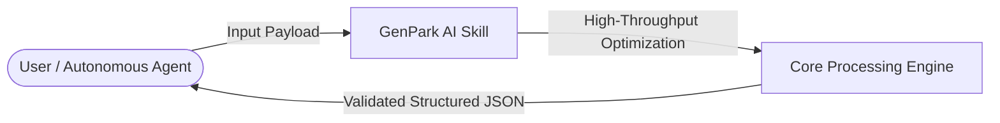

# genpark-unstructured-pdf-document-table-extractor-skill

    

> **GenPark AI Agent Skill** -- Fast unstructured PDF & multi-column table extractor to Markdown/JSON

## 🌟 Why This Skill Matters
This repository provides a lightweight, battle-tested, zero-external-dependency utility designed for high-performance agentic pipelines, RAG systems, and production LLM orchestration.

## 🚀 Quick Start
```python
python example_usage.py
```

## 📊 Agentic Architecture Flowchart


## 🔌 MCP (Model Context Protocol) Integration
Run natively as an MCP server for Cursor, Claude Desktop & custom LLM orchestrators:
```bash
python mcp_server.py
```

## 📄 License
MIT License (c) 2026 GenPark Team. Free for personal and commercial usage.
